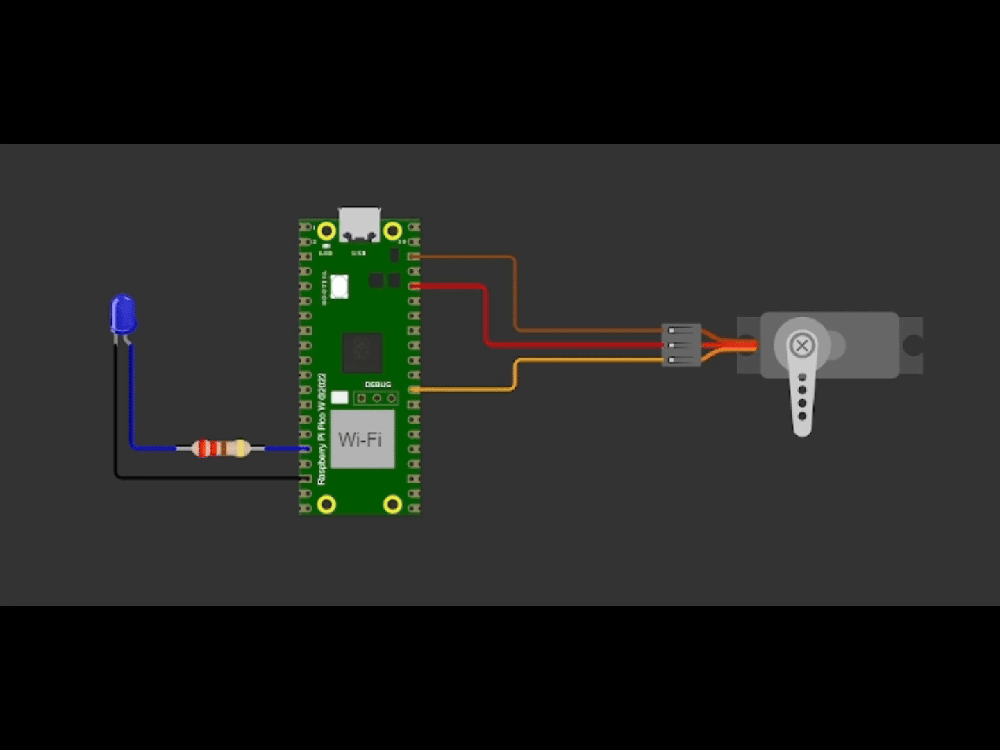

---
<table>
  <tr>
    <td>
      
    </td>
    <td>
      <h1>💡 Projeto: Controle de Servomotor por PWM com Raspberry Pi Pico W</h1>
    </td>
  </tr>
</table>

## 📋 Descrição Geral

Este projeto demonstra o controle de um servomotor utilizando o módulo **PWM** do microcontrolador **RP2040** (Raspberry Pi Pico W). Com o uso do **Pico SDK** e simuladores como o **Wokwi/BitDogLab**, o sistema gera sinais PWM para posicionar o servomotor em ângulos específicos e realizar uma varredura suave entre 0° e 180°. Paralelamente, um LED RGB (simulado na GPIO 12) pisca para indicar que o microcontrolador está executando múltiplas tarefas simultaneamente.

---

## 🎯 Objetivos

- **Configuração do PWM:**  
  Gerar sinal PWM a 50 Hz (20 ms de período) na GPIO 22, permitindo a precisão de 1 µs por tick.

- **Posicionamento do Servomotor:**  
  Definir pulso de:
  - **2400 µs** para posicionar o servo em aproximadamente **180°**.
  - **1470 µs** para posicionar o servo em aproximadamente **90°**.
  - **500 µs** para posicionar o servo em aproximadamente **0°**.  
  Cada posição é mantida por 5 segundos.

- **Varredura Suave:**  
  Realizar um movimento contínuo do servo entre 0° e 180°, ajustando o pulso em incrementos/decrementos de 5 µs a cada 10 ms, garantindo um deslocamento gradual.

- **Feedback Visual com LED:**  
  Controlar um LED RGB (GPIO 12) para piscar periodicamente, demonstrando a execução concorrente das tarefas no microcontrolador.

---

## 🛠 Componentes Utilizados

- **Raspberry Pi Pico W**  
  Microcontrolador baseado no RP2040.

- **Servomotor (simulado)**  
  Servomotor padrão controlado via PWM na GPIO 22.  
  *(Utilizado em ambiente de simulação no Wokwi/BitDogLab)*

- **LED RGB (simulado)**  
  LED conectado à GPIO 12 para indicar o status do sistema.

---

## 🗂 Estrutura do Projeto

```plaintext
servomotor_pwm/
├── assets
│   ├── logo.jpeg
│   └── wokwi.gif              
├── src
│   └── main.c 
├── wokwi
│   ├── diagram.json
│   └── wokwi.toml
├── .gitignore
├── CMakeLists.txt
├── LICENSE
└── README.md             
```

---

## 🚀 Funcionalidades do Projeto

1. **Configuração do PWM:**  
   - O sinal PWM é configurado para operar a 50 Hz (20 ms de período) na GPIO 22.
   - O divisor de clock é ajustado para que cada tick represente 1 µs, permitindo a definição precisa dos pulsos.

2. **Posicionamento do Servomotor:**  
   - **2400 µs:** Define a posição aproximada de **180°**.
   - **1470 µs:** Define a posição aproximada de **90°**.
   - **500 µs:** Define a posição aproximada de **0°**.  
   Cada posição é mantida por 5 segundos.

3. **Varredura Suave:**  
   - Após os posicionamentos fixos, o servo realiza uma varredura contínua entre 0° e 180°.
   - A varredura é feita com incremento ou decremento de 5 µs a cada 10 ms, garantindo um movimento gradual.

4. **Controle do LED:**  
   - Um LED RGB (na GPIO 12) pisca periodicamente (aproximadamente a cada 100 ms), demonstrando a execução de tarefas em paralelo.

---

## 🔧 Instalação e Execução

### 1. Configuração do Ambiente

- Certifique-se de que o [Pico SDK](https://github.com/raspberrypi/pico-sdk) esteja instalado e devidamente configurado.
- Utilize um ambiente de desenvolvimento como o **VS Code** com as extensões para C/C++.

### 2. Clonando o Repositório

Clone o repositório para sua máquina:

```bash
git clone https://github.com/otilianojunior/servomotor_pwm.git
cd servomotor_pwm
```

### 3. Compilação e Upload

No terminal ou através do VS Code:

```bash
mkdir build
cd build
cmake ..
make
```

Após a compilação, será gerado um arquivo (por exemplo, `.uf2` ou `.hex`). Para testar:

- **No Raspberry Pi Pico W:**  
  Copie o arquivo gerado para o dispositivo (certifique-se de que o Pico esteja em modo bootloader).

- **Simulação no Wokwi/BitDogLab:**  
  Importe o projeto no simulador e configure as conexões:
  - **GPIO 22:** Sinal PWM para o servomotor.
  - **GPIO 12:** LED RGB.

---

## 📸 Testes no Wokwi

Abaixo, um exemplo da simulação no Wokwi:

<p align="center">
  
</p>

---

## 📁 Entregáveis

- **Código-Fonte:**  
  Todo o código fonte deste projeto encontra-se neste repositório.

- **vídeo Ensaio:**  
  [Link para o Vídeo](https://drive.google.com/file/d/1ZsINNTb97TPNRAALzobcL31s2tJ0x1RF/view?usp=sharing)

---

## ✅ Conclusão

Este projeto oferece uma oportunidade prática para explorar o controle de dispositivos via PWM, demonstrando como posicionar um servomotor de forma precisa e suave. A utilização simultânea do LED RGB reforça a capacidade do microcontrolador de executar múltiplas tarefas, tornando-o ideal para aplicações em sistemas embarcados.

---

_Desenvolvido por Otiliano Junior_


---

